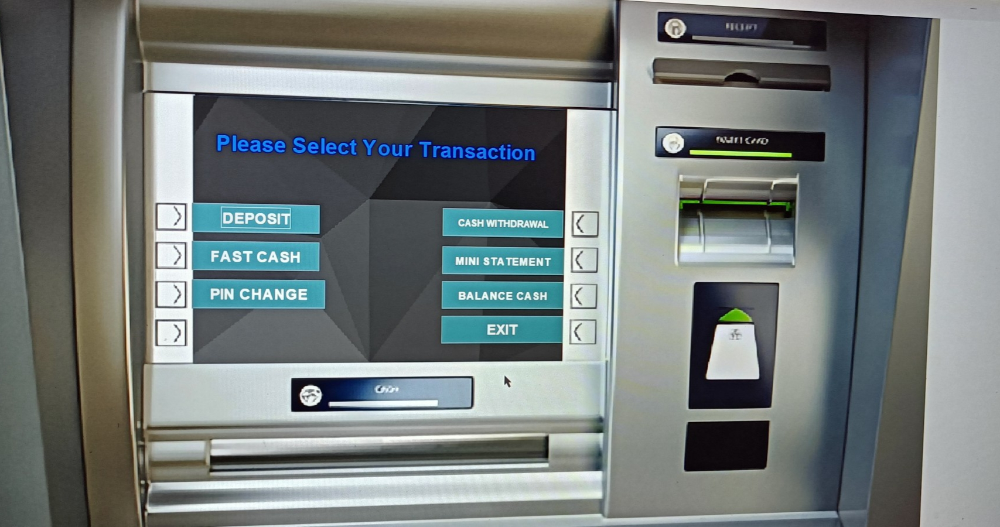

<h1>🏦 SecureBank Management System</h1>

<h3>📌 Overview</h3>

SecureBank Management System is a Java-based banking application that simulates
basic banking operations such as account creation, deposits, withdrawals,
and balance inquiry. The project demonstrates <b>Object-Oriented Programming (OOP)</b>,
GUI development using <b>Java Swing</b>, and database connectivity using <b>JDBC</b>.

The system is built with Java Swing for the graphical user interface and uses MySQL with JDBC for database connectivity. It allows efficient management of customer accounts and financial transactions in a structured way.

This project is developed as a learning application to help understand how banking systems handle customer data, process transactions, and maintain secure financial records. It also provides practical experience in Java development, database integration, and building management systems.

<h3>🚀 Features</h3>
<ul>
<li>🔐 User Login Authentication</li>
<li>👤 Create New Bank Account</li>
<li>💰 Deposit Money</li>
<li>💳 Withdraw Money</li>
<li>📊 Balance Inquiry</li>
<li>🧾 Transaction History</li>
<li>🏦 Customer Account Management</li>
</ul>

<h3>🛠 Technologies Used</h3>
<ul>
<li>Java</li>
<li>Java Swing (GUI)</li>
<li>JDBC</li>
<li>MySQL</li>
</ul>

<h3>⚙️ Installation</h3>
<ol>
<li>Clone the repository</li>
</ol>

<pre>
git clone https://github.com/suvamkabi-software/SecureBank-Management-System.git
</pre>

<ol start="2">
<li>Open the project in an IDE like IntelliJ IDEA, Eclipse, or NetBeans</li>
<li>Configure the MySQL database</li>
<li>Compile and run the main class</li>
</ol>
<pre>
javac login.java
java login
</pre>
<h2>📂 Project Structure</h2>
<pre>
SecureBank-Management-System
│
├── src/
│   ├── Login.java
│   ├── Signup.java
│   ├── Deposit.java
│   ├── Withdraw.java
│   └── BalanceEnquiry.java
│
├── database/
│   └── data_base_connect.sql
│
└── README.md
</pre>

<h3>👨‍💻 Author</h3>

<b>Suvam Kabi</b> 
GitHub: 
<a href="https://github.com/suvamkabi-software">
https://github.com/suvamkabi-software
</a>

<h5>How to Run

1. Clone the repository
git clone https://github.com/suvamkabi-software/SecureBank-Management-System

2. Compile the program 
javac Main.java

4. Run the program
java login.java</h5>

<h2>Project Screenshot</h2>

https://github.com/user-attachments/assets/79246114-6c29-4118-9f9b-27a2ecda93a4

